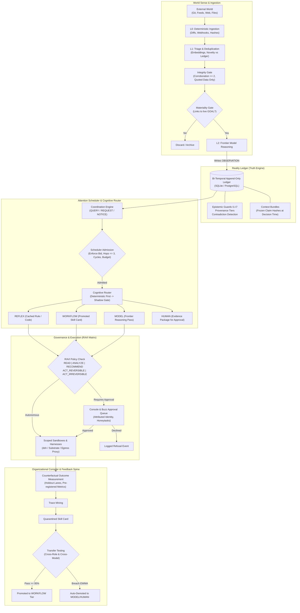

# Vital
# Grounding, Reflex & Governance Layer for Production AI Agents

> **The Deepest Principle:** *Model output can never mint a FACT.*

[](#current-state)
[](#prerequisites)
[](#tech-stack)
[](#1-the-reality-ledger)
[](#5-governance--the-rai-autonomy-matrix)
[](#license)

Vital is a **ledger of claims**, a **scheduler of attention**, and a **compiler of procedures** for organizations deploying autonomous AI agents in production. It bridges the critical gap between raw LLM generation and enterprise-grade reliability.

The single source of truth for the project specification is [`idea.md`](idea.md). The build checklist is [`TODO.md`](TODO.md) and [`Final_TODO.md`](Final_TODO.md).

---

## Quick Navigation

- [In Simple Words: The 30-Second Explanation](#in-simple-words-the-30-second-explanation)
- [In Professional Terms: The Engineering Thesis](#in-professional-terms-the-engineering-thesis)
- [The 4 Fatal Flaws Vital Solves](#the-4-fatal-flaws-vital-solves)
- [How It Works: End-to-End Architecture](#how-it-works-end-to-end-architecture)
- [The Flagship Wedge: Governed Ship-to-Result](#the-flagship-wedge-governed-ship-to-result)
- [The Core Subsystems](#the-core-subsystems)
  - [1. The Reality Ledger (Claims & Invariants)](#1-the-reality-ledger)
  - [2. Attention Scheduler & Coordination](#2-attention-scheduler--coordination)
  - [3. Cognitive Router (4 Execution Classes)](#3-cognitive-router)
  - [4. Organizational Compiler & Transfer Testing](#4-organizational-compiler--transfer-testing)
  - [5. Governance & The R/A/I Autonomy Matrix](#5-governance--the-rai-autonomy-matrix)
  - [6. World Sense & Adversarial Integrity Gate](#6-world-sense--adversarial-integrity-gate)
  - [7. Talk Surface & Cryptographic Identities](#7-talk-surface--cryptographic-identities)
  - [8. Substrate, Sandboxes & Harness Integration](#8-substrate-sandboxes--harness-integration)
- [User Surfaces: Web Console & Marketing Site](#user-surfaces-web-console--marketing-site)
- [Project Directory & Codebase Map](#project-directory--codebase-map)
- [5-Minute Quickstart & Boot Guide](#5-minute-quickstart--boot-guide)
- [CLI Reference Guide](#cli-reference-guide)
- [The Metric Contract & KPIs](#the-metric-contract--kpis)
- [Rules of Working Here](#rules-of-working-here)

---

## In Simple Words: The 30-Second Explanation

Imagine hiring 100 enthusiastic junior interns who work at lightning speed, never sleep, but occasionally hallucinate facts, overcommit to expensive tasks, repeat mistakes others already solved, and might accidentally publish unauthorized pricing changes to your live customers.

Without Vital:
- Agents talk to each other in chat rooms, repeating rumors until everyone believes a hallucination is true.
- Agents spend thousands of dollars in API fees on endless loops without finishing any work.
- If an agent does an irreversible action (like refunding a client or modifying production code), nobody can answer: *Who authorized this? On what basis? What claims did they read at that exact second?*

**With Vital:**
1. **Agents are never allowed to invent truth.** An agent can make a `HYPOTHESIS` or a `PREDICTION`, but it can **never** mint a `FACT`. Only verified systems of record or measurement instruments can create facts.
2. **Every task has a hard budget.** Before an agent starts work, it must submit a "bid" (max dollars, tokens, human minutes, deadline, and a hop limit). If it exceeds the budget, it is stopped immediately.
3. **Refusal is a feature, not a bug.** Agents have the right to refuse ungrounded or out-of-budget work. If refusal is 0%, your agents are people-pleasing sycophants.
4. **Learning requires proof.** When an agent solves a task well, Vital turns it into a reusable procedure ("Skill Card") — but **quarantines** it until it passes strict transfer tests across different models and departments.
5. **Irreversible actions require human command.** Safe tasks (reading, summarizing) run autonomously. Dangerous or irreversible tasks (deploys, refunds, public posts) stop and demand human sign-off with clear evidence attached.

---

## In Professional Terms: The Engineering Thesis

Companies have information systems (GitHub, CRM, Slack, Datadog, Jira), but no **intelligence-and-action governance system**. Modern LLMs reason well, but they fail enterprise deployment because:
- They cannot distinguish what they **know** from what they **inferred**.
- They generate **unbounded work** with no budget, hop limit, or deadline.
- They **repeat intelligence** on problems the organization has already solved.
- They take **actions nobody can attribute, replay, or reverse**.

Vital implements a mathematically verified runtime layer above agent harnesses (such as [deepseek-harness](https://github.com/deepseek-ai/deepseek-harness) and [QM](https://github.com/yc-software/qm)) and chat transports (such as [Buzz](https://buzz.xyz) or Slack):

$$\text{North Star Metric} = \frac{\text{Total Intelligence Cost}}{\text{Verified Good Decisions}} \quad (\searrow \text{decreasing over time})$$

Vital's core moat is not the LLM or the harness; it is the **accumulated, immutable corpus of claims, frozen decision contexts, counterfactual outcomes, and transfer-tested procedures.**

---

## The 4 Fatal Flaws Vital Solves

| Fatal Flaw | How Other Agent Systems Fail | Vital's Architectural Solution | Source Module |
| :--- | :--- | :--- | :--- |
| **1. Epistemic Drift & Hallucination** | Agents accept model generations as facts. Hallucinations compound across multi-agent turns. | **Epistemic Invariant I1**: Model output can *never* mint a `FACT`, `MEASUREMENT`, or `OUTCOME`. Weakest-link provenance tracking. | `src/ledger/ledger.ts` |
| **2. Unbounded Loops & Runaway Cost** | Agents spawn infinite sub-agents, ping-ponging requests across channels until token/API limits blow up. | **Attention Scheduler**: Explicit `CostBid`, hard hop limit (3), cycle detection, daily caps, and an escalation cap that **blocks**. | `src/coord/coordinator.ts` |
| **3. Fake Learning & Procedure Rot** | Agents claim to "learn" by appending unverified text into vector memory, which rots and fails upon transfer. | **Organizational Compiler**: Lifecycle (`QUARANTINE` → `SHADOW` → `PILOT` → `PROMOTED`). Cross-model transfer tests; EWMA live drift demotion. | `src/compiler/compiler.ts` |
| **4. Unattributable Action & Rubber-Stamping** | Chat logs serve as audit trails. Humans approve 200 items/day mindlessly without understanding context. | **R/A/I Matrix & Context Bundles**: Freezes exact claim IDs & hashes at decision time. Honeytasks catch human rubber-stamping. | `src/gov/trust.ts`, `src/ledger/ledger.ts` |

---

## Why not just Grok Bot + Slack? — What chat alone cannot guarantee

**What Grok Bot is (per [x.ai/bot](https://x.ai/bot), [docs.x.ai/grok-bot/overview](https://docs.x.ai/grok-bot/overview), [Introducing Grok Bot](https://x.ai/news/introducing-grok-bot)):**
a persistent, named teammate on its own cloud computer (browser, filesystem, terminal). It signs into your tools and uses them like you do — connectors/MCP where available, computer-use where there is no API — keeps memory/files/browser sessions across turns, and multiple Bots on one account share that computer so they can message each other, share context in threads/group chats and hand off tasks. You message it like a teammate, it finishes jobs end-to-end and comes back for approval. Requires SuperGrok / Cursor plan (separate Bot usage), beta as of Aug 2026.

Slack (or Buzz/Nostr) is the *talk layer* — where humans and agents coordinate visibly. Grok Bot's threads are the system of record in that design.

Vital is the **governance layer above any harness** (dsh, QM, Grok Bot) **and any talk surface** (Buzz, Slack). You can run Grok Bot *as* the harness under Vital — Vital still enforces what Grok Bot alone does not document.

| Capability | Grok Bot + Slack (as documented) | Vital (this repo, enforced in code) |
| :--- | :--- | :--- |
| **Who can mint truth?** | Any Bot output can be posted to Slack; no documented invariant prevents a model generation from becoming a `FACT` in your store. | **I1 hard invariant** (`src/ledger/ledger.ts`): model output can *never* mint `FACT`/`MEASUREMENT`/`OUTCOME`; only `SYSTEM_OF_RECORD`/`MEASURED` provenance can. Proven by `test/ledger.test.ts` adversarial 11-kinds. |
| **Can a runaway loop bankrupt you?** | Bots run until done; they share a computer and can trigger each other in threads. No documented hard hop limit, dollar/token cap, or daily escalation cap. | **Attention Scheduler** (`src/coord/coordinator.ts`): every `REQUEST` carries a `CostBid` ($, tokens, human-minutes, deadline, **max hops = 3**, cycle detection, daily caps, **escalation cap 3/day that blocks**). Budget death is loud, not silent. |
| **Does “learning” rot?** | “Bots keep memory and learn from each other” — no documented quarantine or cross-model/role transfer test before reuse. | **Organizational Compiler** (`src/compiler/compiler.ts`): `QUARANTINE → SHADOW → BOUNDED_PILOT → PROMOTED` with **cross-model + cross-role transfer tests + EWMA drift auto-demotion**. Imported `SKILL.md` packs enter at `QUARANTINE` by design. |
| **Who approved what, on what basis, at what second?** | Chat thread is the audit trail; approvals are messages. No frozen claim-hashes at decision time documented. | **Context Bundles** (`src/ledger/ledger.ts`) freeze exact claim IDs/versions/hashes at decision seconds; `decisionId` replays years later. `R/A/I` matrix (`src/gov/trust.ts`) + **honeytasks** catch rubber-stamping; freezes autonomy. |
| **Reversible vs irreversible?** | Bots “use your apps just like you do” including irreversible tools; approval is a chat reply. | **R/A/I Autonomy Matrix** (`READ | ANALYZE | RECOMMEND | ACT_REVERSIBLE | ACT_IRREVERSIBLE` where `ACT_IRREVERSIBLE` is *never autonomous in Year 1*). Scoped sandboxes + egress proxy (`src/substrate/`). |
| **If the harness changes, does truth survive?** | Harness and chat are the system. Swap Grok Bot for another harness and history is chat logs. | **Ledger is the only store** (`src/talk/surface.ts` HMAC/Buzz binding, `idea.md` §3): swap Buzz→Slack or dsh→Grok Bot with **zero ledger change** — proven by `src/talk/surface.ts` `TalkSurface` swappability spike. |
| **Chat itself** | Polished chat (threads, group chats, @-mentions, shared computer). | **Same chat UX** (`buzz/` → Image 1: avatar stream, Linear card, ✅ 1 🚀 2, `@` autocomplete, `Message #engineering` composer) but every message is **grounded**: claim chips, `derived_from` links, and `[HUMAN ATTENTION REQUIRED]` cards that cannot be approved by reacting. |

> **Bottom line:** Grok Bot is the best *hands* (persistent computer + multi-tool use + bot-to-bot handoffs). Slack is the best *mouth* (threads). Vital is the **memory + conscience + budget office** that makes hands and mouth safe for production: without it, chat *is* the ledger, loops are unbounded, and learning is a vector-store append.

---

## How It Works: End-to-End Architecture



### The Three Fundamental Layers

1. **The Talk Layer ([Buzz](https://buzz.xyz) / Nostr / Slack):** Where humans and agents coordinate visibly with cryptographic signatures. A channel is a *projection*, never the store of record.
2. **The Compute Layer (Substrate + [deepseek-harness](https://github.com/deepseek-ai/deepseek-harness)):** Ephemeral sandboxes where tools execute under strict network egress proxies and command policies.
3. **The Claim Layer (The Reality Ledger):** What is true, what is believed, and what was decided. The **only** place claims live.

---

## The Flagship Wedge: Governed Ship-to-Result

Instead of attempting to "run the whole company," Vital enters through one high-visibility, revenue-critical loop: **Ship-to-Result** (`src/wedge/ship.ts`).

```
[ Git Release / Commit Detected ]
               │
               ▼
[ 1. Verified Change Summary ] ── (Extracts diff, checks claims against Ledger)
               │
               ▼
[ 2. Scope Fan-Out ] ──────────── (Emits typed REQUESTs under strict bids)
               ├─► Engineering: Technical validation & changelog
               ├─► Marketing: Customer announcement draft & blog
               ├─► Support: Support macros & FAQ updates
               ├─► Sales: Battlecard updates & affected customer segments
               └─► Documentation: Developer docs diff
               │
               ▼
[ 3. Evidence Review Queue ] ──── (Console renders diffs, provenance chips, and claim citations)
               │
               ▼
[ 4. Human Decision ] ─────────── (Session-attributed approval, rationale captured, honeytasks verified)
               │
               ▼
[ 5. Execution & Delivery ] ───── (Reversible actions run via sandboxes; irreversible via human command)
               │
               ▼
[ 6. Counterfactual Measurement ] (Measures support tickets, adoption lift, and customer errors vs holdouts)
               │
               ▼
[ 7. Decision + Outcome Writeback ] (Context Bundle frozen; trace submitted to Compiler for Skill Card mining)
```

Other specialized wedges included:
- **Churn Mitigation Loop (`src/wedge/churn.ts`)**: Ingests risk signals, validates against customer claims, and drafts retention proposals.
- **Feature Request Trace (`src/wedge/feature.ts`)**: Synthesizes customer requests into PRDs and testable engineering plans.
- **Agentic Deep Research (`src/wedge/deepresearch.ts`)**: Multi-step plan $\rightarrow$ human approve $\rightarrow$ scoped web crawl $\rightarrow$ cited report.

These three are library work with passing tests, not user paths: no console route, CLI command or worker handler runs them today (AUDIT.md §5 defers them behind the Ship-to-Result slice). The Rooms Setup preset that carried their names now says so in the interface.

---

## The Core Subsystems

### 1. The Reality Ledger

The Reality Ledger (`src/ledger/ledger.ts`) is an append-only, bi-temporal datastore enforcing the epistemology of the company.

#### The 11 Claim Kinds

```
OBSERVATION  ──►  MEASUREMENT  ──►  FACT
     │
     ├──►  BELIEF       ──►  ASSUMPTION  ──►  HYPOTHESIS  ──►  PREDICTION
     │
     └──►  GOAL         ──►  DECISION    ──►  ACTION      ──►  OUTCOME
```

#### Provenance Tiers (Weakest-Link Wins)

$$\text{SYSTEM\_OF\_RECORD} > \text{MEASURED} > \text{PRIMARY} > \text{CORROBORATED} > \text{SINGLE\_SOURCE} > \text{SELF\_SERVED}$$

#### The 7 Hard Invariants (Enforced in Code)

| Invariant | Rule | Architectural Guarantee | Proving Test |
| :---: | :--- | :--- | :--- |
| **I1** | **No Generated Facts** | Agents may create `BELIEF`, `ASSUMPTION`, `HYPOTHESIS`, `PREDICTION`, `OBSERVATION`, `DECISION`, `ACTION`. Agents may **NEVER** mint `FACT`, `MEASUREMENT`, or `OUTCOME`. | `test/ledger.test.ts` (adversarial: all 11 kinds) |
| **I2** | **Ground Provenance Required** | `FACT` and `MEASUREMENT` require `SYSTEM_OF_RECORD` or `MEASURED` provenance regardless of author. | `test/ledger.test.ts` (300-append property test) |
| **I3** | **No Orphan Claims** | Every single claim must have a named human owner. | `test/ledger.test.ts` (`orphanClaims === 0`) |
| **I4** | **Contradiction Flips to Disputed** | A `contradicts` link immediately flips both claims to `DISPUTED` and creates an audit resolution ticket. | `test/ledger.test.ts` (`I4: contradiction flips both`) |
| **I5** | **Automated Staleness Sweep** | Claims past `valid_until` are flipped to `STALE` on periodic sweeps. | `test/ledger.test.ts` (`I5: staleness sweep`) |
| **I6** | **High-Tier Context Filter** | Reasoning context for high-tier actions includes **only** `VERIFIED`, unexpired, non-provisional claims. | `test/ledger.test.ts` (`I6: contextFor excludes stale`) |
| **I7** | **Append-Only History** | Rows are never rewritten or deleted. Superseding writes a new row with a `supersedes` link. | `test/ledger.test.ts` (`append-only: supersedeChain`) |

#### Replayable Context Bundles

When a `DECISION` is recorded, Vital freezes a **Context Bundle** containing the exact claim IDs, versions, and SHA-256 hashes active at that second. A decision can be replayed years later to prove what the company believed at that instant.

---

### 2. Attention Scheduler & Coordination

Located in `src/coord/coordinator.ts`. Prevents runaway token consumption and multi-agent recursion.

#### The 3 Message Classes

| Class | Purpose | Budgeting | Refusable? | Human Interrupt? |
| :--- | :--- | :--- | :---: | :---: |
| `QUERY` | Read-only question | Tokens only | Yes | **Never** |
| `REQUEST` | Bounded work with a deliverable | Full `CostBid` | **Yes (logged)** | Only in origin channel |
| `NOTICE` | FYI / update | None | N/A | **Never (digest only)** |

#### Structural Guardrails

- **Explicit Cost Bids (`CostBid`):** Dollars, tokens, human minutes, deadline, max rounds, max hops, and stop conditions.
- **Hard Hop Limit (3):** Work chains cannot exceed 3 hops between agents.
- **Cycle Detection:** Inherited hop chain graph traversal stops circular delegation dead.
- **Loud Budget Death:** When an agent runs out of tokens or dollars, it is terminated with a logged audit failure—never silently continued.
- **Sycophancy Metric:** Tracks agent refusal rates. If an agent's refusal rate is 0%, it is flagged for people-pleasing over-commitment.
- **Human Escalation Cap:** Strictly limits human interruptions per scope per day (default 3/day) and **blocks** when exceeded.
- **Durable Room Agents vs Ephemeral Workers:** A room agent is cheap durable configuration (permissions, scope, memory). Workers are ephemeral processes spawned for a request that die on completion.

---

### 3. Cognitive Router

Located in `src/router/router.ts`. Evaluates inbound tasks and selects the most efficient, cost-effective execution class.

```
Incoming Task
     │
     ▼
[ R1: Deterministic Registry ] ──► (Matches rule/pattern) ──► Tier 1: REFLEX ($0.00)
     │ (ambiguous)
     ▼
[ R2: Shadow Mode Check ] ───────► (controlRate === 0 until precision >= 0.90 on 2k samples)
     │ (control granted)
     ▼
[ R3: Asymmetric Loss Check ] ───► (Is action irreversible?) ──► Tier 4: HUMAN (Fail Up)
     │ (safe / validated)
     ▼
[ R4/R5: Skill Card Available? ] ─► (Promoted card in scope)  ──► Tier 2: WORKFLOW
     │ (novel task)
     ▼
[ Tier 3: MODEL ] ───────────────► (One reasoning pass on scoped harness)
```

- **R1 Deterministic First:** Rules handle high-volume routine tasks with zero LLM inference cost.
- **R2 Shadow Until Proven:** Starts at `controlRate = 0`. The router shadow-logs choices until clearing its precision gate ($\ge 2,000$ labeled samples at $\ge 0.90$ precision).
- **R3 Asymmetric Loss (Fail Up):** For high-blast-radius or irreversible tasks, misrouting down is unacceptable; the router automatically escalates to `HUMAN`.
- **R4 Error Budgets:** Exceeding an error budget reverts that tier to fixed safe policies.
- **R5 Coupling Guard:** A Skill Card may only run at the tier and within the scope for which it was validated.

---

### 4. Organizational Compiler & Transfer Testing

Located in `src/compiler/compiler.ts`. Implements the findings of the **AFTER benchmark** ([arXiv 2606.23127](https://arxiv.org/abs/2606.23127)): *procedural memory improves accuracy, but skills strongly specialize to their origin role and degrade during cross-role transfer.*

#### The Skill Card Lifecycle

```
TRACE  ──►  CANDIDATE  ──►  QUARANTINE  ──►  SHADOW  ──►  BOUNDED_PILOT  ──►  PROMOTED (scoped)
                                                                                   │ (EWMA breach)
                                                                                   ▼
                                                                                DEMOTED
```

- **Bad Teacher Filter:** Traces with unresolved outcomes or confidence $<0.5$ are rejected at compilation.
- **Imported Skill Packs (`SKILL.md`):** Any external or third-party skill pack (QM/TDAM/marketplaces) enters at `QUARANTINE`, never higher.
- **Promotion Gates:**
  - $\rightarrow$ `SHADOW`: Requires regression tests and reference eval suite.
  - $\rightarrow$ `BOUNDED_PILOT`: Requires cross-model transfer tests + $\ge 20$ shadow runs at $\ge 0.90$.
  - $\rightarrow$ `PROMOTED`: Requires cross-role transfer tests + $\ge 50$ pilot runs at $\ge 0.95$.
- **Scope Expansion:** A card promoted in Marketing **cannot** execute in Sales without a dedicated `cross_role` transfer test for Sales.
- **Drift Monitoring:** Rolling EWMA over live outcomes. If performance degrades, the card is **automatically demoted** to `MODEL`/`HUMAN` and a drift ticket is opened.

---

### 5. Governance & The R/A/I Autonomy Matrix

Located in `src/gov/trust.ts` and `src/gov/raci.ts`. Autonomy is never granted globally to an agent; it is granted strictly per **Action Class $\times$ Scope**.

| Action Class | Definition & Examples | Default State | Promotion Path |
| :--- | :--- | :--- | :--- |
| `READ` | Querying systems, reading files | Autonomous | Autonomous immediately |
| `ANALYZE` | Summarizing data, building models | Autonomous | Eval suite pass |
| `RECOMMEND` | Proposing actions to humans | Autonomous | Precision $\ge$ threshold |
| `ACT_REVERSIBLE` | Internal tickets, drafting PRs, scheduling, feature flags | Approval Required | Trust Ledger + 200 clean executions with 0 overrides |
| `ACT_IRREVERSIBLE` | Publishing publicly, modifying pricing, prod deploys, refunds | **Human Command Always** | **Never autonomous (strictly forbidden in Year 1)** |

#### Anti-Approval-Fatigue Machinery

1. **Honeytasks:** Known-good and known-bad items seeded randomly into the human approval queue. If an operator approves a known-bad honeytask, their oversight is marked as compromised.
2. **Autonomy Freeze:** If human detection of bad items falls below threshold, the system automatically freezes autonomy across the scope.
3. **Approval Sampling:** A random fraction of auto-approved actions are routed to deep human review to catch silent drift.
4. **Batch Ceilings:** Batching is strictly forbidden for high-blast-radius actions.
5. **3-Level Emergency Stops (Kill Switches):** Instantly disengagable at `tenant`, `scope`, or `action_class` level. Drilled and verified quarterly (`vital stop`, `vital drill`).
6. **EU AI Act Article 14 Compliance:** Engineered for meaningful human oversight, reversibility, and intervention.

---

### 6. World Sense & Adversarial Integrity Gate

Located in `src/sense/`. Manages external intelligence collection without falling victim to manipulation.

```
L0 COLLECT  Deterministic polling, RSS, webhooks, JSON diffs, GitHub releases. ($0.00, no LLM)
    ↓
L1 TRIAGE   Novelty check vs Reality Ledger, embeddings deduplication, entity classification.
    ↓       ──► [ Materiality Gate: Must link to a live GOAL or revenue/cost path ]
L2 REASON   Frontier model reasoning (sees <0.1% of raw collected data).
```

#### The Adversarial Threat & Integrity Gate

Competitors and attackers can deliberately poison blogs, publish fake changelogs, seed repositories, or astroturf forums to manipulate your agent's strategic roadmap.
- **$\ge 2$ Independent Provenance Paths:** Strategic signals remain `CANDIDATE` until corroborated across two independent sources.
- **Self-Serving Source Discount:** Vendor changelogs and marketing blogs receive discounted prior weights.
- **Quoted Data Enforcement:** External text enters the reasoning model strictly as sanitized, quoted data with source chrome—**never as system instructions, prompts, or tool selectors.**

---

### 7. Talk Surface & Cryptographic Identities

Located in `src/talk/`. Implemented for [Buzz](https://buzz.xyz) (Nostr-based protocol with cryptographic public/private keys) with seamless swap-safety to Slack.

- **Cryptographic Personas:** Every room agent and human holds a verified keypair.
- **Signed envelopes (spike, not wired):** `src/talk/surface.ts` implements signed envelopes over the ledger's opaque payload, and the spike's result is real — the binding needs no ledger change, so Buzz is swappable for Slack. **Nothing in the console, worker or CLI signs or verifies through `TalkSurface` today**, so this is a design proof, not a live integrity guarantee. Disposition in AUDIT.md §5.
- **Channels as Projections:** Chat channels render human-readable threads with evidence chips, but the conversation history in chat is **never** the system of record. The Reality Ledger remains the sole source of truth.

---

### 8. Substrate, Sandboxes & Harness Integration

Located in `src/substrate/`, `src/dsh/` (and legacy `src/jcode/`).
- **Manifest-Rebuildable Sandboxes:** Sandboxes contain tools and temporary files, but persistence is never trust-bearing. A compromised sandbox can be destroyed and rebuilt from an immutable manifest in seconds.
- **Egress Policy:** every model and outbound decision passes one decision core (`src/substrate/egress.ts`) that denies non-allowlisted domains and blocks loopback and cloud metadata endpoints (`169.254.169.254`, `metadata.google.internal`). A forward proxy that enforces the same policy for a sandbox (`src/substrate/egress-proxy.ts`) is implemented and tested, but **no deployment starts it yet** — sandboxes are not pointed at it, so enforcement happens at the decision call rather than at the socket. Disposition in AUDIT.md §5.
- **dsh Integration:** Vital drives [deepseek-harness](https://github.com/deepseek-ai/deepseek-harness) (vendored in-tree at `vendor/deepseek-harness/`, MIT) as an SDK-runtime child process over stdio JSON-RPC (`dsh --profile sdk`). Tool calls are gated by Vital's R/A/I policy engine — client-side per-turn, plus an in-runtime approval-answerer plugin (`src/dsh/vital-approval.mjs`) mounted via `--patch` — ensuring agents cannot grant themselves permissions. The jcode sibling integration (`src/jcode/`, NDJSON over Unix sockets) is superseded but retained until the dsh adapter is proven.

---

## User Surfaces: Web Console & Marketing Site

Vital provides two coordinated interfaces: an interactive marketing site and a hardened, authenticated enterprise console.

### The Marketing Site (`site/`)

- Built with modern HTML5, Vanilla CSS, and modular JavaScript.
- Features a real-time **Three.js WebGL interactive matrix visual** (`site/graphics.js`, `site/assets/three.min.js`).
- Displays a live system status pill connected to `/api/health`.
- Completely functional without JavaScript enabled (WCAG accessible fallback).

### The Authenticated Console (`src/console/`)

Co-hosted with the marketing site via `vital serve --site site` or served standalone.

```
┌────────────────────────────────────────────────────────────────────────┐
│ VITAL CONSOLE    [System Readiness: ● DB OK  ● Worker OK  ● Ingest OK] │
├────────────────────────────────────────────────────────────────────────┤
│ [Dashboard]  [Evidence Queue]  [Rooms]  [Team]  [Audit]  [Learning]   │
├────────────────────────────────────────────────────────────────────────┤
│ PENDING APPROVALS (Needs a Human)                                     │
│  • REQ-482: Ship-to-Result launch blog (Marketing)                     │
│    Bid: $4.50 / 12k tokens | Claims cited: 4 (All Verified)          │
│    [Inspect Diff]  [Review Context Bundle]  [Approve]  [Decline]       │
├────────────────────────────────────────────────────────────────────────┤
│ REALITY LEDGER HEALTH                                                  │
│  • Stale Fact Rate: 0.4% (<2%)      • Orphan Claims: 0                 │
│  • Contradictions Open: 0           • Provenance Completeness: 100%    │
├────────────────────────────────────────────────────────────────────────┤
│ COMPILER BOARD                                                         │
│  [Quarantine: 2] -> [Shadow: 4] -> [Pilot: 1] -> [Promoted: 12]        │
└────────────────────────────────────────────────────────────────────────┘
```

#### Key Console Features

- **Initial Tenant Claiming & Signup:** The first user to visit `/signup` on loopback claims owner status for the tenant. Once claimed, signup closes permanently; subsequent users are **invite-only**.
- **Enterprise Security:** Salted scrypt password hashing (12-char minimum), HttpOnly SameSite session cookies, double-submit CSRF protection, brute-force lockout (5 failed attempts per tenant/ip/email), and optional MFA (TOTP + recovery codes).
- **Role-Gated RBAC:** Three tiers (`owner`, `admin`, `member`) with configurable approver role floors (`--approver-role`).
- **Evidence Review & Approval Queue:** Paginated review interface showing exact claim diffs, rationale inputs, and cryptographic provenance before signing off.
- **Audit Log Viewer (`/console/audit`):** Queryable, immutable log of all tenant mutations, approvals, logins, and permission checks.
- **Learning & Skill Board (`/console/learning`):** Full visibility into Skill Card states, shadow execution results, transfer test scores, and drift alerts.
- **Data Portability & GDPR Erasure (`/console/data`):**
  - **Export:** Verified, manifest-signed snapshot, evidence package, or backup reference.
  - **Erasure:** Export-first, audited tenant erasure (`vital erase`) leaving a permanent verification receipt while purging all tenant rows, sessions, and unshared artifacts.

---

## Project Directory & Codebase Map

```
Hackathon/
├── src/
│   ├── cli.ts                   # Unified CLI entrypoint (status, verify, serve, worker, etc.)
│   ├── core/                    # Types, SQLite/PostgreSQL drivers, auth, sessions, GDPR erasure
│   │   ├── auth.ts              # Scrypt auth, RBAC, sessions, CSRF, MFA (TOTP)
│   │   ├── db.ts                # Database connection & migration engine
│   │   ├── erasure.ts           # Export-first GDPR tenant erasure
│   │   └── types.ts             # Core type definitions (Claims, Messages, Bids, States)
│   ├── ledger/                  # Reality Ledger (Invariants I1-I7, Context Bundles, Replay)
│   │   ├── export.ts            # Ledger streaming export with SHA-256 manifests
│   │   ├── ledger.ts            # Claim storage, contradiction detection, staleness sweep
│   │   └── s3store.ts           # External storage adapter
│   ├── coord/                   # Attention Scheduler (Bids, Hops, Cycles, Budgets, Refusal)
│   │   ├── coordinator.ts       # QUERY/REQUEST/NOTICE admission & scheduler
│   │   └── execution-spec.ts    # Bounded execution contracts
│   ├── router/                  # Cognitive Router (4 classes, shadow mode, asymmetric loss)
│   │   └── router.ts            # REFLEX, WORKFLOW, MODEL, HUMAN dispatch logic
│   ├── compiler/                # Organizational Compiler (Procedural memory lifecycle)
│   │   ├── compiler.ts          # Skill Card mining, gates, transfer tests, EWMA drift
│   │   ├── registry.ts          # Skill Card catalog & validation rules
│   │   └── transfer.ts          # Cross-model and cross-role test harness
│   ├── gov/                     # Governance (R/A/I Matrix, Honeytasks, Emergency Stops)
│   │   ├── act.ts               # Action execution pathways
│   │   ├── raci.ts              # R/A/I permission matrix
│   │   ├── shell.ts             # Deterministic shell command policy filter
│   │   └── trust.ts             # Honeytasks, sampling, autonomy freeze, kill switches
│   ├── sense/                   # World Sense (Watch Contracts, Funnel, Integrity Gate)
│   │   ├── integrity.ts         # Adversarial integrity gate (corroboration, quoted data)
│   │   ├── poisoning.ts         # Red-team poisoning test fixtures
│   │   └── watch.ts             # Watch Contract compiler & materiality gate
│   ├── wedge/                   # Production entry loops
│   │   ├── churn.ts             # Churn response workflow
│   │   ├── deepresearch.ts      # Agentic deep research workflow
│   │   ├── feature.ts           # Feature request synthesis workflow
│   │   └── ship.ts              # Governed Ship-to-Result release loop
│   ├── console/                 # Web Console HTTP server, routes, and renderers
│   │   ├── audit.ts             # Audit log viewer
│   │   ├── learning.ts          # Compiler & Skill Card dashboard
│   │   ├── render.ts            # Light/teal semantic HTML rendering engine
│   │   ├── report.ts            # Metrics aggregator & ledger summary
│   │   └── serve.ts             # HTTP server, session middleware, route dispatcher
│   ├── substrate/               # Sandboxes, schedulers, egress proxies
│   │   ├── egress-proxy.ts      # SSRF & cloud metadata endpoint blocking proxy
│   │   ├── harness.ts           # Harness adapter contracts
│   │   └── sandbox.ts           # Manifest-rebuildable execution environments
│   ├── dsh/                     # dsh SDK-runtime adapter (stdio JSON-RPC)
│   │   ├── client.ts            # SDK wire client & session-event mapping
│   │   ├── runner.ts            # Governed run: policy gate, budget, Ledger writeback
│   │   ├── adapter.ts           # HarnessAdapter implementation
│   │   ├── policy-snapshot.ts   # Frozen policy core for the in-runtime answerer
│   │   ├── policy-plugin.ts     # Per-run snapshot + --patch overlay generator
│   │   ├── launch.ts            # DSH_* env -> client options
│   │   └── vital-approval.mjs   # In-runtime approval-answerer Cordis plugin
│   ├── jcode/                   # Legacy jcode sibling client (superseded, retained)
│   ├── talk/                    # Talk Surface (Buzz / Nostr / Slack cryptographic bindings)
│   │   ├── buzz-runtime.ts      # Real-time room thread updates
│   │   ├── surface.ts           # Cryptographic signature to claim binding
│   │   └── agent-keys.ts        # Persona keypair management
│   ├── ingest/                  # Finite collectors (File, Git, Serper) & checkpointing
│   ├── evals/                   # Evaluation spine & prompt injection red-team suite
│   ├── attrib/                  # Counterfactual attribution & causal holdouts
│   ├── aws/                     # AWS Fargate / Lambda / RDS deployment adapters
│   └── vendor/qm/               # Pinned MIT leaf modules from QM (governor, ship-gate, policy)
├── site/                        # Marketing landing page & static assets
│   ├── index.html               # Product landing page with WCAG accessible fallback
│   ├── styles.css               # Design system tokens, typography, dark palette
│   ├── app.js                   # Navigation & dynamic `/api/health` status pill
│   ├── graphics.js              # Three.js 3D WebGL background animation
│   └── assets/three.min.js      # Vendored Three.js library
├── test/                        # Full test suite (739 tests, real sockets, real sqlite)
│   ├── run.ts                   # Master test runner
│   ├── fake-harness.ts          # Real socket server for jcode protocol testing
│   ├── fake-dsh-runtime.mjs      # Fake stdio JSON-RPC server for dsh SDK-wire testing
│   └── *.test.ts                # Unit and integration test files
├── scripts/                     # Operational verification & maintenance utilities
│   ├── refresh-docs.mjs         # Test-count freshness synchronizer
│   ├── verify-provenance.mjs    # Upstream SHA provenance checker for vendored code
│   └── verify-topology.mjs      # Production topology health probe
├── docs/                        # Architecture decision records & deployment specs
│   ├── adr/                     # Architectural Decision Records (ADR 0001–0005)
│   ├── deployment.md            # Production deployment specifications
│   ├── glossary.md              # Domain terminology definitions
│   └── invariants.md            # Ledger invariants I1-I7 with proving test citations
└── idea.md                      # Complete system specification (Single Source of Truth)
```

---

## 5-Minute Quickstart & Boot Guide

### Prerequisites

- **Node.js**: `22.x` (or newer)
- **Database**: Zero external dependencies required for local use! Uses Node's built-in `node:sqlite` by default. (PostgreSQL is supported via `DATABASE_URL`).

### 1. Installation & Validation

```bash
# Clone the repository
git clone https://github.com/your-org/vital.git
cd vital

# Install dependencies
npm install

# Verify TypeScript type safety (must be 0 errors)
npm run typecheck

# Run the complete test suite (<!-- vital:testcount -->961/961 tests green<!-- /vital:testcount -->)
npm test
```

### 2. Booting the Console & Marketing Site

Start the authenticated server on port 3100, mounting the persistent database and serving the marketing landing page:

```bash
npx tsx src/cli.ts serve --db var/vital.db --tenant acme --port 3100 --site site
```

- Open **`http://127.0.0.1:3100`** in your browser to view the marketing site with its live status pill.
- Click **"Sign In"** or navigate to **`http://127.0.0.1:3100/signup`** to claim tenant ownership.
- The first user to register on loopback becomes the **Owner**. After initial claim, `/signup` closes permanently and the console transitions to invite-only.

#### Headless Bootstrapping (CI / Automated Deployments)

For automated environments, bootstrap an owner without the browser:

```bash
VITAL_BOOTSTRAP_EMAIL=admin@acme.corp VITAL_BOOTSTRAP_PASSWORD='a-very-secure-password' \
  npx tsx src/cli.ts serve --db var/vital.db --tenant acme
```

Or via direct CLI signup:

```bash
npx tsx src/cli.ts signup --db var/vital.db --tenant acme \
  --email admin@acme.corp --password 'a-very-secure-password' --name "System Admin"
```

### 3. Running with In-Process Application Worker

To execute scheduled background tasks, harness coordination, and Buzz room progress streaming:

```bash
npx tsx src/cli.ts serve --db var/vital.db --tenant acme --port 3100 --site site --with-worker
```

### 4. Running Browser Review Tests

Verify full browser navigation, login, pagination, claim diffs, approvals, and declines using Playwright:

```bash
npx playwright install chromium
npm run test:browser
```

---

## CLI Reference Guide

The unified CLI entrypoint is `src/cli.ts` (or `npm run dev -- <cmd>`):

```bash
# ==========================================
# SYSTEM STATUS & READINESS
# ==========================================
# Check instance readiness (database, worker heartbeat, integration health)
npx tsx src/cli.ts status --readiness --tenant acme

# Inspect active emergency stops
npx tsx src/cli.ts status --stops --tenant acme

# View governed policy settings inventory
npx tsx src/cli.ts status --policy

# ==========================================
# VERIFICATION & HEALTH CHECKS
# ==========================================
# Run database migrations and smoke probe
npx tsx src/cli.ts verify --db var/vital.db

# Verify an erasure receipt and export file
npx tsx src/cli.ts verify --erasure-receipt acme --db var/vital.db

# Validate a policy change without applying it
npx tsx src/cli.ts verify --policy-change router.controlRate=0.2 --db var/vital.db

# ==========================================
# EMERGENCY STOPS & DRILLS
# ==========================================
# Engage an immediate emergency stop on a scope and action class
npx tsx src/cli.ts stop --engage engineering/ACT_REVERSIBLE --reason "Investigating schema drift" --tenant acme

# Recover an engaged emergency stop
npx tsx src/cli.ts verify --recover-stop engineering/ACT_REVERSIBLE --reason "Hotfix verified" --tenant acme

# Run a policy-only kill switch drill (verifies halt logic without engaging stops)
npx tsx src/cli.ts drill --policy-only --tenant acme

# Run a runtime halt drill (briefly engages real stop, verifies halt, then releases)
npx tsx src/cli.ts drill --runtime --scope engineering --class ACT_REVERSIBLE --tenant acme

# ==========================================
# FINITE EVIDENCE INGESTION
# ==========================================
# Ingest flat directory evidence into the Ledger (writes OBSERVATIONs, never facts)
npx tsx src/cli.ts ingest-files --tenant acme --scope engineering \
  --source data/incoming --artifacts var/ingest-artifacts --db var/vital.db --max-receipts 50

# Test a directory collector and verify integration health
npx tsx src/cli.ts ingest-test --source data/incoming --tenant acme

# ==========================================
# DATA PORTABILITY & RETENTION
# ==========================================
# Generate a verified HTML report of rooms, claims, and open approvals
npx tsx src/cli.ts report --db var/vital.db --tenant acme --out var/report.html

# Stream an immutable ledger export with a SHA-256 signed manifest
npx tsx src/cli.ts report --manifest snapshot --tenant acme

# Perform export-first GDPR tenant erasure (requires --yes to commit)
npx tsx src/cli.ts erase --tenant acme --actor compliance-officer@acme.corp --export-to var/exports --yes

# ==========================================
# USER & ACCESS ADMINISTRATION
# ==========================================
# Reset a user's password directly (operator emergency intervention)
npx tsx src/cli.ts passwd --tenant acme --email user@acme.corp --password 'temporary-new-pass'

# Generate a password reset link
npx tsx src/cli.ts reset-link --tenant acme --email user@acme.corp --base-url http://127.0.0.1:3100
```

---

## The Metric Contract & KPIs

Vital's performance is falsifiable and measurable against pre-registered commitments:

| Metric | Definition | Production Gate |
| :--- | :--- | :---: |
| **FACT-Minting Violations** | Model outputs written as `FACT` without SoR evidence | **0 (Hard Invariant I1)** |
| **Stale-Fact Rate** | Unexpired facts vs expired facts past TTL | **$< 2\%$** |
| **Routing Precision** | Correct tier routing on labeled shadow-mode decisions | **$\ge 0.90$ on $\ge 2,000$ samples** |
| **Irreversible-Action Escalation** | Dangerous actions escalated to a human | **100% (Never Autonomous)** |
| **Intelligence Cost per Good Decision** | $(\text{Inference } \$ + \text{Tools } \$ + \text{Human Minutes}) \div \text{Outcomes}$ | **Falling over 3 consecutive quarters** |
| **Honeytask Detection Rate** | Human catch rate on seeded bad approval items | **$\ge 95\%$ (or autonomy freezes)** |
| **Orphan Claims** | Claims without an accountable human owner | **0 (Hard Invariant I3)** |

---

## Current State

<!-- vital:testcount -->961/961 tests green<!-- /vital:testcount --> across the complete suite running against real SQLite databases and real socket connections.

- **Verified and reachable** (a console route, CLI command or worker handler runs it): Reality Ledger (Invariants I1–I7), Context Bundles, Replay, Attention Coordinator, Cognitive Router, R/A/I Matrix, Honeytasks, Emergency Stops, dsh SDK Wire (stdio JSON-RPC) + jcode Harness-API Protocol v1, Authenticated Web Console (Signup, Login, CSRF, RBAC, Review Queue, Rooms Setup, Team Roster, Audit Log, Learning Board, GDPR Erasure), and Marketing Site.
- **Tested primitives, not wired to a product surface:** World Sense Funnel, Adversarial Integrity Gate, Ship-to-Result Wedge, Churn & Feature Loops, Agentic Deep Research, Talk Surface cryptographic binding, the egress forward proxy, cross-model transfer testing, and the serverless microVM labels. Each is covered by tests and documented as a prototype; none is reachable from a user path yet. AUDIT.md carries the per-module disposition, and this line is written to agree with it.
- **One closed loop with an open end:** skill cards are *consumed* at runtime (the worker asks the compiler for an executable card before routing), but nothing in production compiles a card yet — mining surfaces candidates, and compilation stays an explicit, gated act with no exposed trigger. Until that lands the WORKFLOW tier cannot fire on a real tenant.
- **Upstream absorption:** Narrowed, provenance-pinned leaf modules from QM (`governor.ts`, `ship-gate.ts`, `command-policy.ts`, `crypto.ts`, `objects.ts`, `errors.ts`, `safe-regex.ts`) verified by `scripts/verify-provenance.mjs`.

---

## Rules of Working Here

1. **`[x]` means done and verified by a passing test or live run** — never merely "written".
2. **Reading a README is not verification.** Always verify the primary identifier (URL, package manifest, commit SHA), not the marketing badge.
3. **A green typecheck is not a working system.** The only tests that count are those that execute logic and communicate over real interfaces.
4. **Never claim a competitor lacks a control we have not confirmed absent.** State: *"Not documented in public evidence."*
5. **Model output can never mint a FACT.** Preserve epistemic invariant I1 across all PRs.

---

## License

Core runtime code is UNLICENSED / All Rights Reserved. Absorbed leaf modules under `src/vendor/qm/` are licensed under the MIT License — see [`LICENSE-THIRD-PARTY.md`](LICENSE-THIRD-PARTY.md).
